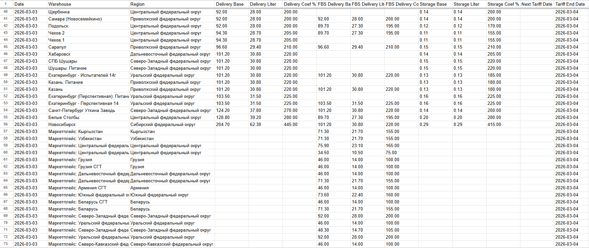

# WB Box Tariffs Tracker

Сервис для автоматического сбора тарифов для коробов Wildberries и экспорта в Google Sheets.

## Что делает

1. **Каждый час** запрашивает актуальные тарифы коробов из WB API (`https://common-api.wildberries.ru/api/v1/tariffs/box`)
2. **Сохраняет** данные в PostgreSQL (upsert по дате + складу)
3. **Выгружает** текущие тарифы в указанные Google Sheets - лист `stocks_coefs` создаётся автоматически, шапка закреплена

### Пример таблицы



## Быстрый старт

```bash
cp example.env .env
```

Заполнить `.env` (подробности ниже) и запустить:

```bash
docker compose up --build
```

Сервис сам выполнит миграции, загрузит первую порцию данных и начнёт обновлять по расписанию.

## Переменные окружения

| Переменная | Описание |
|---|---|
| `POSTGRES_*` | Стандартные настройки PostgreSQL (порт, БД, пользователь, пароль) |
| `APP_PORT` | Порт приложения (по умолчанию `5000`) |
| `WB_API_TOKEN` | API-токен Wildberries (Настройки → Доступ к API) |
| `GOOGLE_SERVICE_ACCOUNT_EMAIL` | Email сервисного аккаунта Google (`xxx@xxx.iam.gserviceaccount.com`) |
| `GOOGLE_PRIVATE_KEY` | Приватный ключ из JSON-файла сервисного аккаунта (всё содержимое поля `private_key`) |
| `GOOGLE_SPREADSHEET_IDS` | ID Google-таблиц через запятую. ID берётся из URL таблицы: `https://docs.google.com/spreadsheets/d/{ID}/edit` |

## Настройка Google Sheets

1. Создать проект в [Google Cloud Console](https://console.cloud.google.com/) (или использовать существующий)
2. Включить **Google Sheets API** в разделе «APIs & Services» → «Enable APIs»
3. Создать сервисный аккаунт в разделе «IAM & Admin» → «Service Accounts»
4. Создать ключ для сервисного аккаунта (тип JSON), скопировать `client_email` и `private_key` в `.env`
5. Открыть нужные Google-таблицы → «Поделиться» → добавить email сервисного аккаунта (роль «Редактор») в каждую
6. Скопировать ID таблиц из URL и добавить в `GOOGLE_SPREADSHEET_IDS` через запятую

Лист `stocks_coefs` будет создан автоматически при первом запуске.

## Расписание обновлений

По умолчанию тарифы обновляются **каждый час** (cron: `0 * * * *`). Расписание задаётся в `src/app.ts` в формате cron:

```
┌───────── минута (0-59)
│ ┌─────── час (0-23)
│ │ ┌───── день месяца (1-31)
│ │ │ ┌─── месяц (1-12)
│ │ │ │ ┌─ день недели (0-7, 0 и 7 = воскресенье)
│ │ │ │ │
0 * * * *
```

Примеры:
- `0 * * * *` — каждый час в :00
- `*/30 * * * *` — каждые 30 минут
- `0 */2 * * *` — каждые 2 часа
- `0 9,18 * * *` — в 9:00 и 18:00

## Разработка

Запустить только БД:
```bash
docker compose up -d postgres
```

Запустить приложение локально:
```bash
npm run dev
```

Миграции вручную:
```bash
npm run knex:dev migrate latest
```

Полная пересборка (для финальной проверки):
```bash
docker compose down --rmi local --volumes
docker compose up --build
```

## Стек

- **Node.js 20** + TypeScript (ESM)
- **PostgreSQL 16** (Alpine)
- **knex.js** — миграции и запросы
- **googleapis** — Google Sheets API
- **node-cron** — планировщик
- **Docker Compose** — оркестрация
